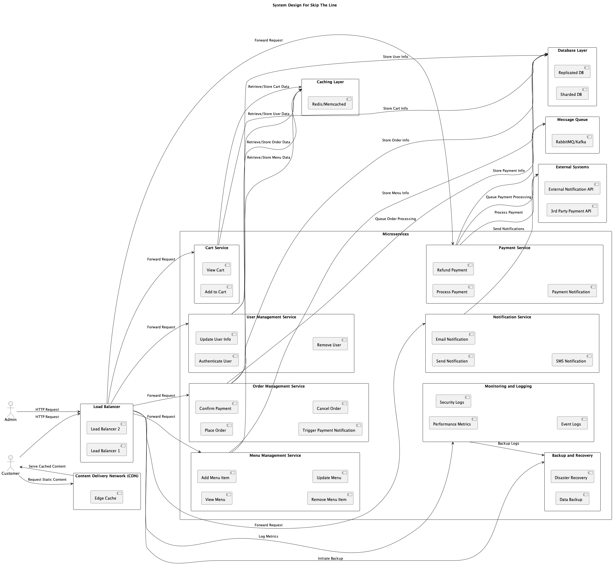

<h1>Software Design Specification</h1>
<!-- SECTION ONE -->
<h2>Overview</h2>

    This architecture is designed for an e-commerce platform specializing in
    online food ordering services, focusing on efficient user interaction
    management, order processing, and payment handling. While the "Skip the
    Lines" application serves as a practical example, the concepts presented
    are broadly applicable to any microservices-based system.
    The architecture is engineered to support between 1,000 and 10,000
    requests per second (RPS) per data center. It employs a microservices
    approach, where each service is dedicated to specific functionalities,
    allowing for scalable and independent deployment. This design enhances
    scalability, maintainability, and agility while facilitating effective
    fault isolation.

Key elements of this architecture include a 

<ul>
    <li>Load balancer</li>
    <li>Content Delivery Network (CDN)</li>
    <li>Caching Mechanism</li>
    <li>Microservices
        <ul>
            <li>Menu Service</li>
            <li>Payment Service</li>
            <li>Order Service</li>
            <li>Wait Time Service</li>
            <li>User Management Service</li>
            <li>Menu Management Service</li>
        </ul>
    </li>
    <li>Database layer</li>
    <li>Message queues</li>
    <li>Monitoring, logging</li>
    <li>Backup and Recovery systems</li>
</ul>

This design document details the critical components and technologies
necessary to build a resilient and cost-effective e-commerce platform,
illustrating how these elements work together to deliver a
high-performance solution in real-world scenarios.

<h2>Overivew</h2>

This Software Requirements Specification (SRS) document describes the functional and non-functional requirements for the Food Ordering App. The app is designed to allow customers to order food online, enabling cooks to manage and complete orders, and allowing administrators to manage the system efficiently.

For the final product:
[project page](https://jashandeep.co.uk).

Submit bug reports and feature suggestions, or track changes in the
[JIRA Ticket](https:/jashandeep.co.uk).

<h2>Scope</h2>

This is the initial version of the software product, with minimal available information. This documentation provides a quick start guide to help you understand and implement the <a>usecase</a>. The functionality can be further extended in future iterations to meet specific business requirements.

## Technologies Used

- Python
- JavaScript
- HTML
- Tailwind CSS
- Django
- AWS
- Playwright

## Table of contents

- Usecase Diagrams
- Class modules

## Conventions

- Naming:
  - Python Modules: snake_case
  - JavaScritp Modules: CamelCase
  - HTML Modulues: snake_case
- Template:
  - APP/templates/
- Static Files:
  - APP/static/
- Hashing Alogrithms Used:

  - Password: SHA-256
  - Secure Cookie: SHA-1

- Folder Depth: Max Leves: 3

## Usecase Diagrams

Top Level Design:

## Class Diagrams

## Entity-Relationship Diagram (ERD)

## Components

 

<caption>Componets at highest level<c/aption>

## Files

- Commands:
  - APP/mangement/commands/
    - createMVCModel.py
- Templates
  - APP/template/
    - base.html
- Static Files
  - commom/
    - app.js

## Troubleshooting

[Create Jira Ticket]("sdf")

## FAQ

**Q: What Arch is used?**

**A:** Follow this template. It's fun and easy!

## Maintainers

- <strong>JD</strong>- [jashandeep.co.uk](https://jashandeep.co.uk)  
  under educational interest

#### Revisions

<b><u>10/08/24:</u></b> Intial Draft
