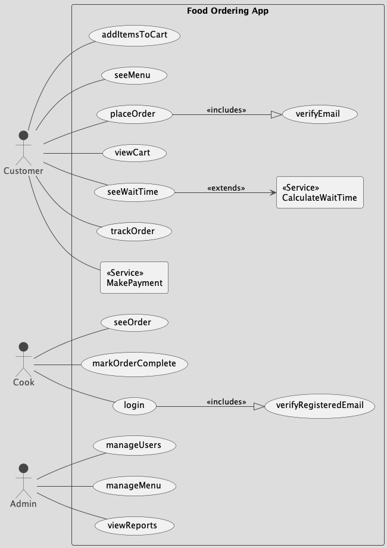
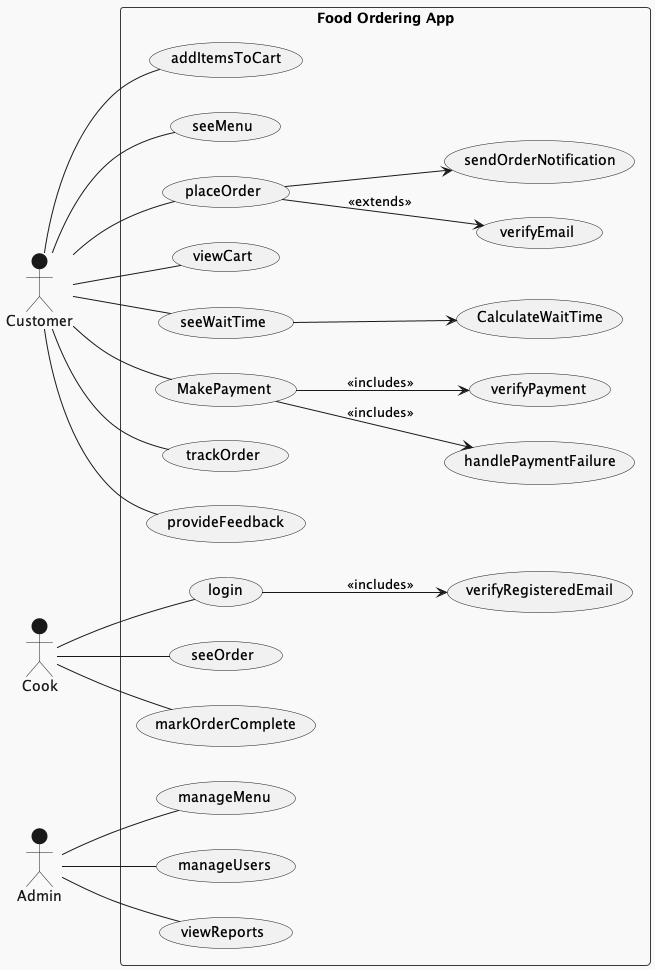
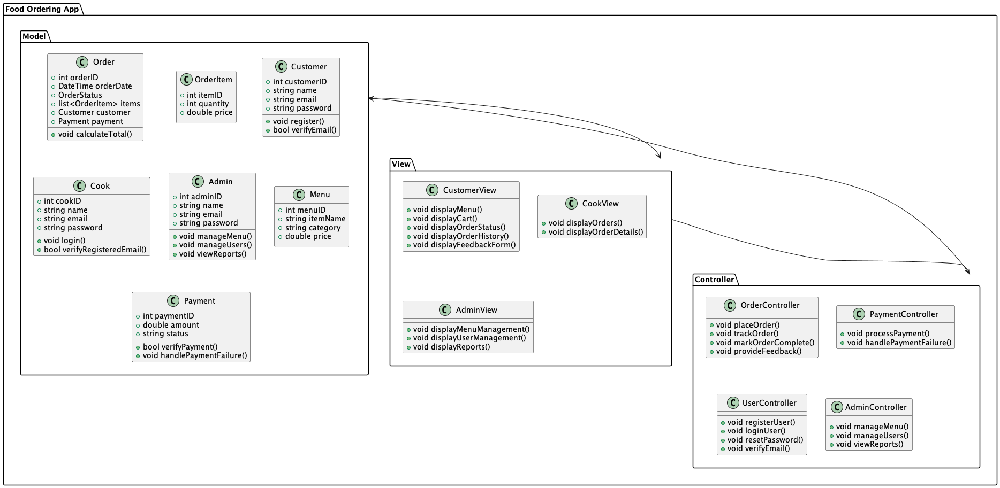
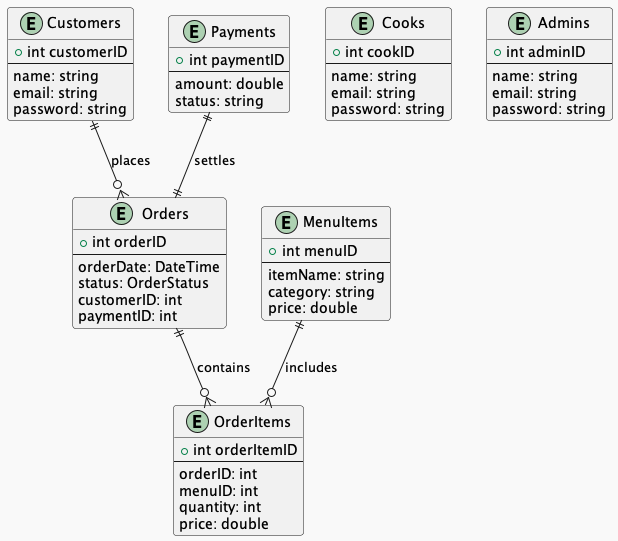
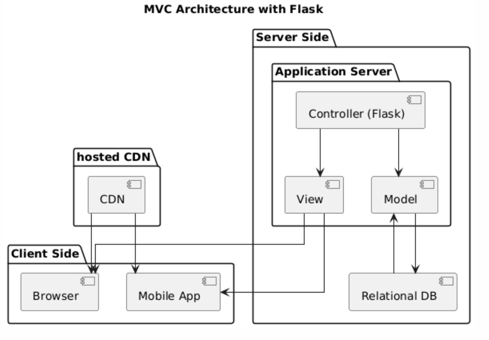

# Software Requirements Specification
FOR
# Food Ordering

This Software Requirements Specification (SRS) document describes the functional and non-functional requirements for the Food Ordering App. The app is designed to allow customers to order food online, enabling cooks to manage and complete orders, and allowing administrators to manage the system efficiently.

For the final product:
[project page](https://jashandeep.co.uk).

Submit bug reports and feature suggestions, or track changes in the
[JIRA Ticket](https:/jashandeep.co.uk).

## Table of contents

- Usecase Diagrams 
- Class modules

## Conventions
- Namimg:
    - Python Modules: snake_case
    - JavaScritp Modules: CamelCase
    - HTML Modulues: snake_case

- Folder Depth: Max Leves: 3

## Files
- Commands:
    - APP/mangement/commands/
        - createMVCModel.py
- Templates
    - APP/template/
        - base.html
- Static Files
    - commom/
        - app.js

## Usecase Diagrams

 
Top Level Design:

Level Two Expantion:

## Class Diagrams

##  Entity-Relationship Diagram (ERD)

## Components
 
Componets at highest level

## Troubleshooting
[Create Jira Ticket]("sdf")

## FAQ 

**Q: What Arch is used?**

**A:** Follow this template. It's fun and easy!

## Maintainers 

- <strong>JD</strong>- [jashandeep.co.uk](https://jashandeep.co.uk)  
under educational interest