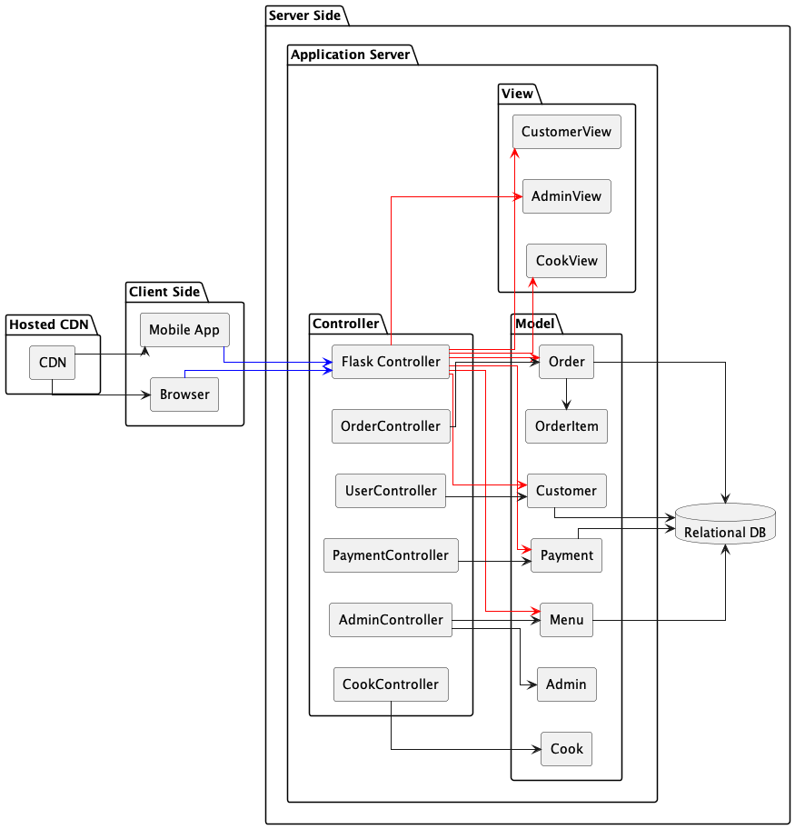

<h1>Software Requirements Specification</h1>
FOR
<h1>Food Ordering Web App</h1>
 

<h2>Overivew</h2>

This Software Requirements Specification (SRS) document describes the functional and non-functional requirements for the Food Ordering App. The app is designed to allow customers to order food online, enabling cooks to manage and complete orders, and allowing administrators to manage the system efficiently.

For the final product:
[project page](https://jashandeep.co.uk).

Submit bug reports and feature suggestions, or track changes in the
[JIRA Ticket](https:/jashandeep.co.uk).

<h2>Scope</h2>

This is the initial version of the software product, with minimal available information. This documentation provides a quick start guide to help you understand and implement the <a>usecase</a>. The functionality can be further extended in future iterations to meet specific business requirements.

## Table of contents

- Usecase Diagrams 
- Class modules

## Conventions
- Naming:
    - Python Modules: snake_case
    - JavaScritp Modules: CamelCase
    - HTML Modulues: snake_case
- Template:
    - APP/templates/
- Static Files:
    - APP/static/
- Hashing Alogrithms Used:
    - Password: SHA-256
    - Secure Cookie: SHA-1

- Folder Depth: Max Leves: 3

## Usecase Diagrams
Top Level Design:

Level Two Expantion:

## Class Diagrams

##  Entity-Relationship Diagram (ERD)

## Components
 
<caption>Componets at highest level<c/aption>

## Files
- Commands:
    - APP/mangement/commands/
        - createMVCModel.py
- Templates
    - APP/template/
        - base.html
- Static Files
    - commom/
        - app.js

## Troubleshooting
[Create Jira Ticket]("sdf")

## FAQ 

**Q: What Arch is used?**

**A:** Follow this template. It's fun and easy!

## Maintainers 

- <strong>JD</strong>- [jashandeep.co.uk](https://jashandeep.co.uk)  
under educational interest

#### Revisions
<b><u>10/08/24:</u></b> Intial Draft